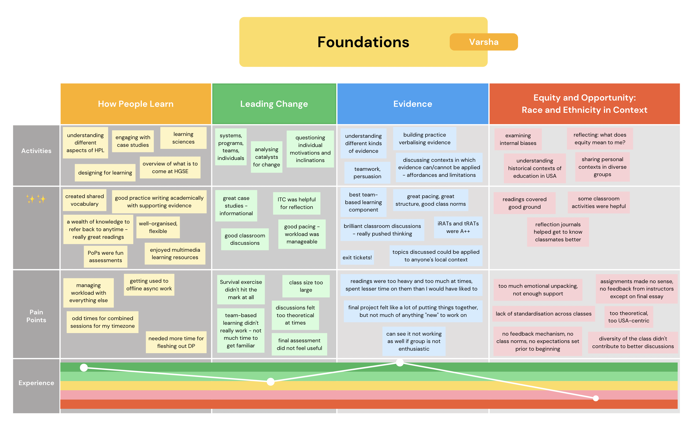

# Learner Journey Map

The first conversation with my Learning from Foundations project team involved us reflecting on why we chose the project. We also made individual learner journey maps to represent our experiences taking the Foundations courses. Here is my Learner Journey Map:

I considered the main themes along which I wanted to organise and represent my thoughts. I decided to highlight the main activities I engaged in, what I found useful, pain points and my overall experience represented visually along the green-red scale (with the upper band - green, being a good experience and the lower band - red, being a poor one).